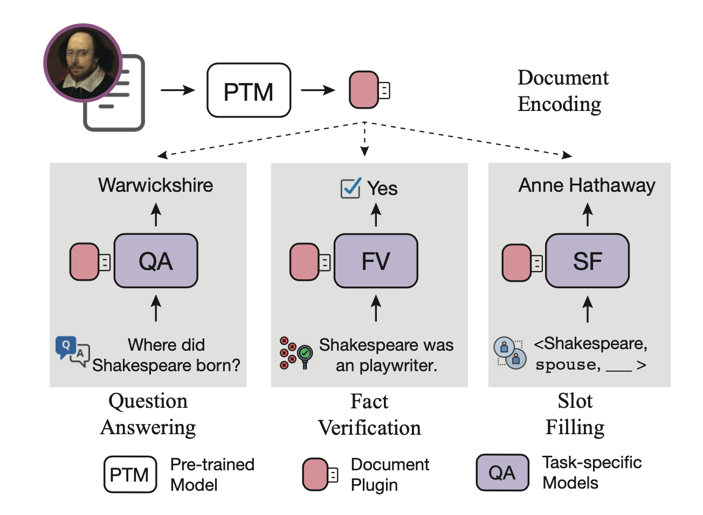

# Plug-and-Play Document Modules for Pre-trained Models

The code and checkpoints of our ACL paper "**Plug-and-Play Document Modules for Pre-trained Models**"


If you use the code, please cite the following paper:

```
@inproceedings{xiao2023plug,
  title={Plug-and-Play Document Modules for Pre-trained Models},
  author={Xiao, Chaojun and Zhang, Zhengyan and Han, Xu and Chan, Chi-Min and Lin, Yankai and Liu, Zhiyuan and Li, Xiangyang and Li, Zhonghua and Cao, Zhao and Sun, Maosong},
  booktitle={Proceedings of ACL},
  year={2023}
}
```


## Quick Links

* [Overview](#overview)
* [Requirements](#requirements)
* [Folder Structure](#folder-structure)
* [Plugin Learning](#plugin-learning)
* [Downstream Tuning](#downstream-tuning)


## Overview



We propose to represent documents as plug-and-play modules for pre-trained language model. In this way, we can decouple document encoding from concrete tasks, and achieve encoding doucments only once for multiple different tasks.


## Requirements

```
kara-storage==2.1.5
transformers==4.26.0.dev0
bmtrain==0.2.2
torch==1.12.1
rouge==1.0.1
```


## Folder Structure

* **`train.py`**: The entry point of all training and evaluation scripts. The arguments for the `train.py` are as follows:
  * `--config/-c`: the configure file path. Almost parameters, including the data path, model hyper-parameters, and so on, will be set in the configure files.
  * `--gpu/-g`: the GPU devices used for running the program. This argument will be used to set the environment variable `CUDA_VISIBLE_DEVICES`.
  * `--checkpoint`: the path of a specific checkpoint, which would be loaded for continual training.
* **`dataset`**: code for reading data into memory
* **`formatter`**: code for processing raw data into tensors, which will be feed into models
* **`model`**: code for our models
* **`config`**: configure files for training and evaluation.
* **`run_script`**: the training scripts.
* **`utils`**: code for pre-processing data and download checkpoints.


## Pluin Learning

In this section, we will present how to conduct plugin learning by using our code.

**Data Preparation**

First, download the C4 dataset and put it in `data/c4-json`. It is worth noting that C4 is a large-scale pre-training dataset, and in this paper we only need to use a small portion of it.

Then, run the following script to store the large-scale dataset into a streaming dataset with the `kara-storage` package:

```bash
python3 utils/parse_c4.py
```

**Model Initialization**

First download the T5-large checkpoints to initalize the model by running the following scripts:

```bash
bash utils/download_t5.sh
```

**Training Scripts**

```bash
bash run_script/PluginLearning/run_plugd_pl.sh
```

The trained chekpoint can be found in `checkpoint/PlugD-large`.

We also provide the trained PlugD chechpoint in [Tsinghua Cloud](https://cloud.tsinghua.edu.cn/f/7573895bf1ed4881a8d5/).


## Downstream Tuning

**Data Preparation**

Please refer to [KILT](https://github.com/facebookresearch/KILT) for the code to conduct retrieval. You can also download the data from [Tsinghua Cloud](https://cloud.tsinghua.edu.cn/d/4ddd19c7758b462f971b/)

Put the data in `data/dpr-top5`

**Training Scripts**

Then you can run downstream task tuning with the following scripts:

```
bash run_script/Downstream/plugd.sh TASK PlugDPATH
```

Here, `TASK` refers to the task to run, and must be in `FEVER, NQ, TQA, HQA, ELI5, WoW, zsRE, TRex`; `PlugDPATH` refers to the checkpoint trained with plugin learning. Notably, PlugD decouples document encoding from concrete tasks, and we can save inference time by pre-encoding the documents. Here, we donot perfrom document pre-encoding due to the limitation of storage.

